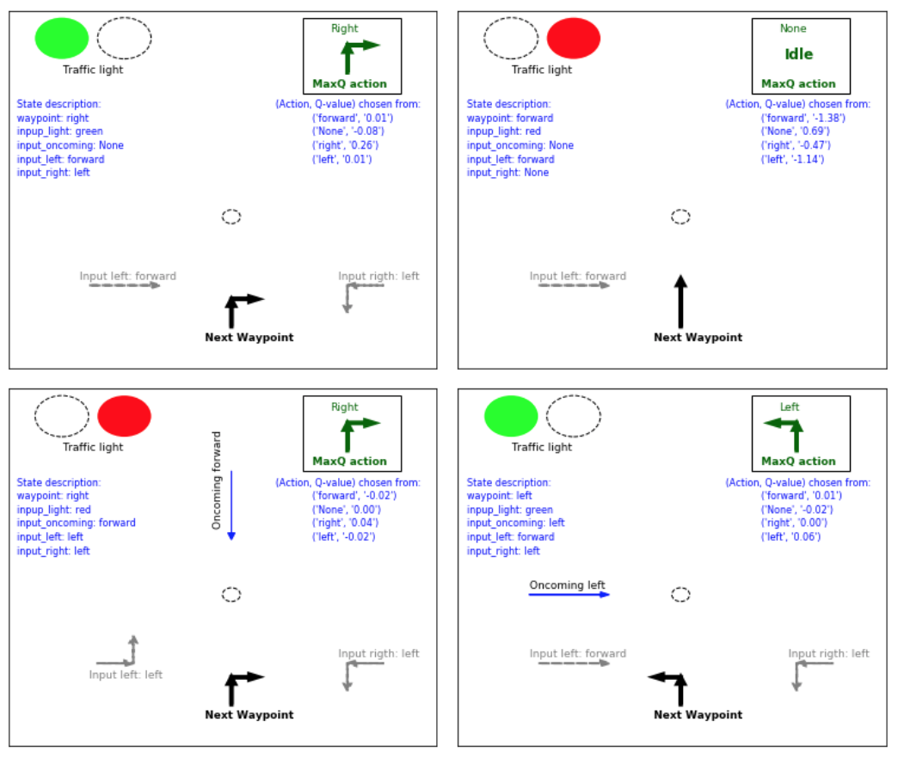

# Training an Autonomous Vehicle using Reinforcement Learning  

### Juan E. Rolon, 2018



## Project overview

In this project, I implemented an application of _Reinforcement Learning_ to develop a training simulator for an autonomous vehicle or smartcab. This project was submitted as part of the requisites to obtain the **Machine Learning** Engineer Nanodegree from Udacity. It also forms part of the **Artificial Intelligence** curriculum.

Along with exploring state-of-the-art reinforcement learning techniques networks classification models, this project deals with important design decisions typically applicable in autonomous vehicle industry.   

## Objectives

- To construct an optimized Q-Learning driving agent that will navigate a smartcab through its environment towards a fixed destination.   


- To evaluate the peformace of the algorithm on two very important metrics: Safety and Reliability.   


- To maximize the driving agent's safety and reliability to conform transportation industry standards.

## Installation

#### Required Libraries 

- Pygame
- Sklearn 
- Matplotlib
   

### Git Cloning    


Clone the following repository to obtain the required datasets.
	
	```	
		git clone https://github.com/juanerolon/Train-Autonomous-Vehicle.git
	```
    
This project requires **Python 2.7** with the [pygame](https://www.pygame.org/wiki/GettingStarted) library installed

### Required Code

Fully function code is provided in the `smartcab/agent.py` python file. Additional supporting python code can be found in `smartcab/enviroment.py`, `smartcab/planner.py`, and `smartcab/simulator.py`. Supporting images for the graphical user interface can be found in the `images` folder. While some code has already been implemented to get you started, you will need to implement additional functionality for the `LearningAgent` class in `agent.py` when requested to successfully complete the project. 

### Running the Code

In a terminal or command window, navigate to the top-level project directory `smartcab/` (that contains this README) and run one of the following commands:

```python smartcab/agent.py```  
```python -m smartcab.agent```

This will run the `agent.py` file and execute the agent code.

### Analysis

To perform the analysis of the agent simulator ouput you need an IDE capable of editing and running Ipython notebooks. If Jupyter is installed in your distribution:   

`$ jupyter notebook smartcab.ipynb`

## License

The present project constitutes intellectual work towards completion of Udacitys Machine Learning Engineer Nanodegree. You are free to modify and adapt the code to your needs, but please avoid using an exact copy of this work as your own to obtain credits towards any educational platform, doing so may imply plagiarism on your part. 


```python

```
